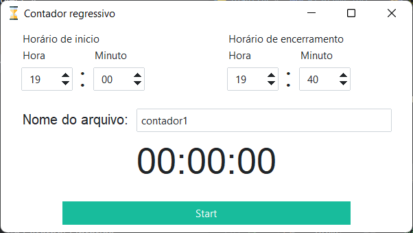
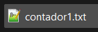
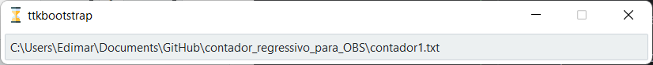
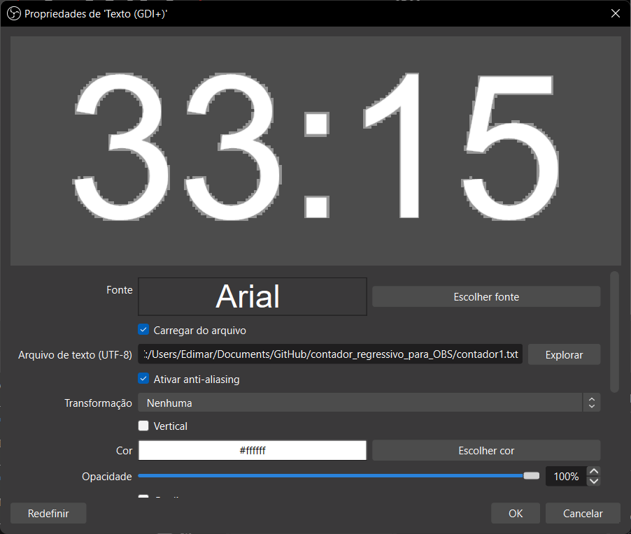

<link href="https://fonts.googleapis.com/css?family=Poppins:600" rel="stylesheet">
<link rel="stylesheet" href="css/style.css">

# Contador regressivo
Trata-se de um contador regressivo simples que gera um arquivo '.txt' que pode ser usado no OBS Studio.


## Requisitos do projeto
- Python 3.11.5
- pip 23.2.1
- Pillow==10.0.1
- ttkbootstrap==1.10.1


## Instalação
1. O primeiro passo é baixar os arquivos do projeto:
````commandline
git clone https://github.com/EdimarDeSa/contador_regressivo_para_OBS.git
````
2. Crie um ambiente virtual para instalar os módulo requeridos:<br>
### Para Windows
````commandline
python -m venv .venv
````

### Para Linux
````commandline
python3 -m venv .venv
````

3. Agora basta instalarmos os módulos de requisito:
````commandline
pip install -r requirements.txt
````

## Instruções de uso
Após iniciar o programa uma a GUI irá se abrir:<br>
<br>

<p>
    Note que ele já vem com um horário de início e de término por padrão.
</p>
<p>
    Ajuste o horário de inicio e encerramento de acordo com sua necessidade e aperte em 'Start'.
</p>

<p>
    Ao iniciar será gerado um arquivo com o texto de 'Nome do arquivo', por padrão o arquivo irá se chamar 'contador1.txt'
</p>

<br>

<p>
    Também será apresentado o caminho onde o texto foi gerado.
    Para copiar o caminho, basta clicar no texto.
</p>



<p>
    Será possível monitorar esse arquivo para que seja impresso em uma cena do OBS Studio atraves da fonte 'Texto (GDI+)'. Então, colamos o diretório copiado e pronto!
</p>



<p>
Desenvolvido por <a href="https://www.efscode.com.br">EFSCode</a>
</p>
